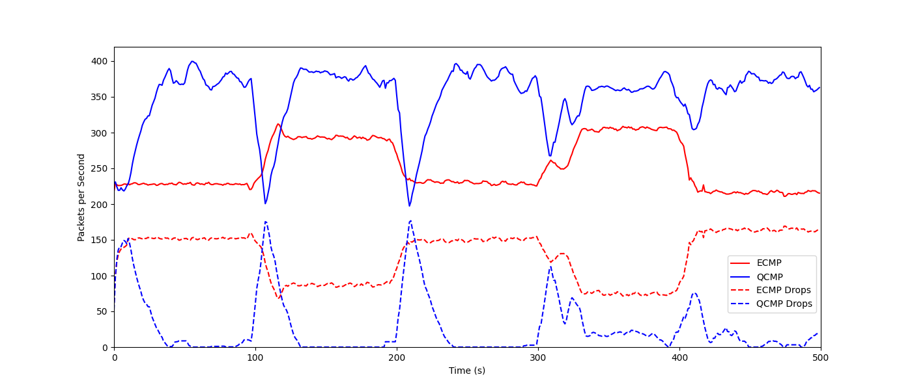
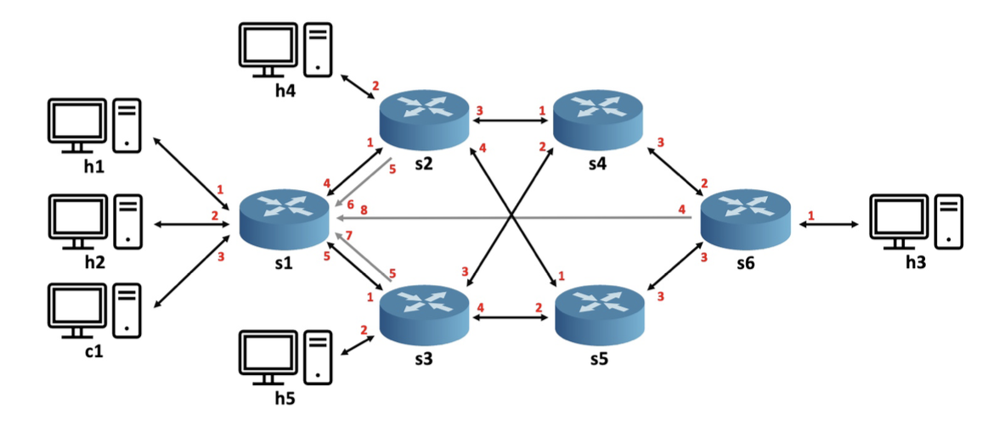

# QCMP
[](https://opensource.org/licenses/Apache-2.0)


## Introduction
QCMP is a Reinforcement Learning based load balancing solution implemented within the data plane, providing dynamic policy adjustment with quick response to changes in traffic. 

## Setting up the environment
QCMP requires BMv2 as a simulation environment. To install the BMv2, follow the guide from [Link](https://github.com/p4lang/behavioral-model). From the link, one setup option is recommended by QCMP, the VirtualBox + VM ```P4 Tutorial Release 2023-04-24.ova```.


## Getting started
To run QCMP, clone the repository ```git clone https://github.com/In-Network-Machine-Learning/QCMP.git``` to a local directory, enter the QCMP folder, and run the following 8 steps:

1. In terminal:
```bash
make run
mininet> xterm h1 h2 h4 h5 s1 s1 s1
```

2. In s1 terminal:
```bash
./set_switches.sh
```

3. In another s1 terminal:
```bash
wireshark
```
, monitoring port ```s6-eth1```, open ```I/O Graph``` under ```Statistics``` bar.

4. In h1 terminal:
```bash
python3 send.py
```

5. In h2 terminal:
```bash
python3 get_queues_layer1.py
```

6. In h4 terminal:
```bash
python3 get_queues_layer2.py
```

7. In h5 terminal:
```bash
python3 get_queues_layer2.py
```

8. In another s1 terminal:
```bash
./change_switches.sh
```

After these 8 steps, wait several minutes and look at the opened ```I/O Graph``` window in step 3. The output shows the QCMP throughput, which will be similar to the graph as follows:



To change weights, please change the numbers in the file ```set_switches.sh``` ```change_switches.sh``` and ```q_table.py``` (function ```init_q_table``` and ```update_q_table``` under the class ```q_table```).


## Used topology
The topology used for this evaluation is shown as follows:



## Reporting a Bug
Please submit an issue with the appropriate label on [Github](../../issues).

## License

The files are licensed under Apache License: [LICENSE](./LICENSE). The text of the license can also be found in the LICENSE file.

## Citation
If you use this code, please cite our [QCMP](https://dl.acm.org/doi/abs/10.1145/3607504.3609291) paper:

```
@inproceedings{zheng2023qcmp,
  title={{QCMP: Load Balancing via In-Network Reinforcement Learning}},
  author={Zheng, Changgang and Rienecker, Benjamin and Zilberman, Noa},
  booktitle={Proceedings of the 2nd ACM SIGCOMM Workshop on Future of Internet Routing \& Addressing},
  pages={35--40},
  year={2023}
}
```
We are also excited to introduce several QCMP related papers ([Planter](https://arxiv.org/pdf/2205.08824.pdf), [IIsy](https://arxiv.org/pdf/2205.08243.pdf), and [DINC](https://ora.ox.ac.uk/objects/uuid:30f4bf57-95bb-4477-aa4d-77d0b9ce76b0/download_file?file_format=application%2Fpdf&safe_filename=Zheng_et_al_2023_DINC_toward_distributed.pdf&type_of_work=Conference+item)): 

```
@article{zheng2022automating,
  title={{Automating In-Network Machine Learning}},
  author={Zheng, Changgang and Zang, Mingyuan and Hong, Xinpeng and Bensoussane, Riyad and Vargaftik, Shay and Ben-Itzhak, Yaniv and Zilberman, Noa},
  journal={arXiv preprint arXiv:2205.08824},
  year={2022}
}

@article{zheng2022iisy,
  title={{IIsy: Practical In-Network Classification}},
  author={Zheng, Changgang and Xiong, Zhaoqi and Bui, Thanh T and Kaupmees, Siim and Bensoussane, Riyad and Bernabeu, Antoine and Vargaftik, Shay and Ben-Itzhak, Yaniv and Zilberman, Noa},
  journal={arXiv preprint arXiv:2205.08243},
  year={2022}
}

@inproceedings{zheng2023dinc,
  title={{DINC: Toward Distributed In-Network Computing}},
  author={Zheng, Changgang and Tang, Haoyue and Zang, Mingyuan and Hong, Xinpeng and Feng, Aosong and Tassiulas, Leandros and Zilberman, Noa},
  booktitle={Proceedings of ACM CoNEXT'23},
  year={2023}
}

@incollection{zheng2021planter,
  title={{Planter: seeding trees within switches}},
  author={Zheng, Changgang and Zilberman, Noa},
  booktitle={Proceedings of the SIGCOMM'21 Poster and Demo Sessions},
  pages={12--14},
  year={2021}
}
```
QCMP is inspired by [Planter](https://github.com/In-Network-Machine-Learning/Planter) and [DINC](https://github.com/In-Network-Machine-Learning/DINC). 


